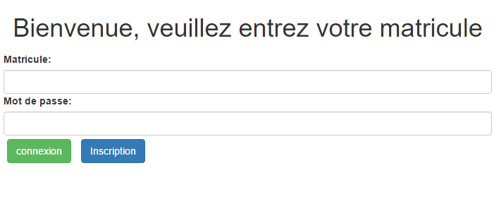
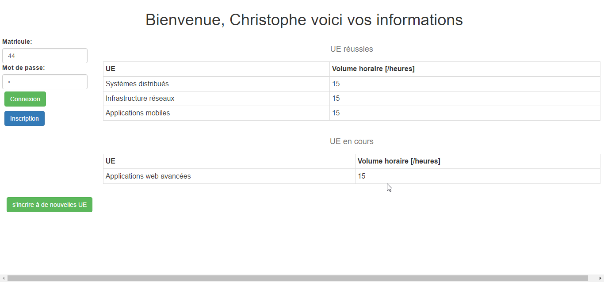
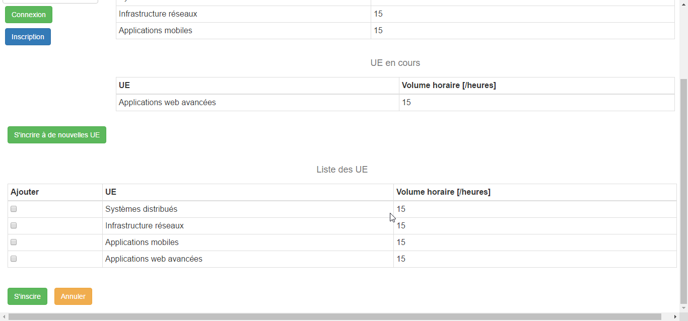

Interface utilisateur
===========

L'interface utilisateur de ce projet est une interface codée en HTML et en jQuery. Elle premet de créer des nouveaux étudiants (students). Elle permet également aux étudiants de se connecter pour avoir accès aux détails de leurs UEs en cours, UE validées. Et pour finir, elle leurs permet de s'inscrire à de nouvelles UEs.

<!-- START doctoc generated TOC please keep comment here to allow auto update -->
<!-- DON'T EDIT THIS SECTION, INSTEAD RE-RUN doctoc TO UPDATE -->
## Table des matières
- [Fonctionement de l'interface](#fonctionement-de-linterface)
  - [La page principale](#la-page-principale)
  - [Étudiant connecté](#%C3%A9tudiant-connect%C3%A9)
  - [S'inscrire à de nouvelles UEs](#sinscrire-%C3%A0-de-nouvelles-ues)
- [Amélioration et défaillances](#am%C3%A9lioration-et-d%C3%A9faillances)

<!-- END doctoc generated TOC please keep comment here to allow auto update -->

## Fonctionement de l'interface
### La page principale

Sur cette page, l'utilisateur a deux options qui s'offrent à lui : 
* se connecter à l'aide de son matricule et de son mot de passe (qui n'est pas géré dans ce prototype) en cliquant sur le bouton `Connexion`
* s'inscrire en cliquant sur le bouton `Inscription`. En cliquant sur ce bouton, l'interface fait alors apparaître des champs supplémentaires que l'utilisateur doit remplir pour s'inscrire.

Si les informations fournies par l'utilisateur sont incorrectes, l'interface affichera un popup approprié.

### Étudiant connecté

Quand un étudiant se connecte, l'interface se déploie et lui affiche deux tableaux contenant la liste des UE en cours et la liste des UE validées.

Il y a également un bouton `S'inscrire à de nouvelles UEs` qui lui permet d'accéder à la dernière partie de l'interface.

### S'inscrire à de nouvelles UEs

Cette dernière partie de l'interface permet à l'étudiant de s'inscrire à de nouvelles UEs en les sélectionnant par les `checkbox`.

Après avoir sélectionné ces UEs, il peut cliquer sur le bouton `S'inscrire` pour les ajouter à sa liste des UE en cours. Il peut également cliquer sur le bouton `Annuler` pour revenir à l'interface précédente.

## Amélioration et défaillances

Pour l'instant l'interface est semi-fonctionnelle à cause d'un problème de communication cross-origin. C'est-à-dire que quand elle envoit une requête vers l'API qui gère les UEs, si cette API tourne sur un autre serveur, la requête va échouer. Pour remédier à ce problème, il faudrait que chaque API ajouter les headers appropriés pour que les navigateurs modernes acceptent le cross-origin. Notre API fait cela correctement.

Pour ne pas rester bloqués, nous avons travaillé avecc une variable locale qui simulait les réponses de l'API UE.

Voici quelques piste d'améliorations :
* Gérer les mots de passe : il faut modifier l'API student pour qu'elle associe un mot de passe à un étudiant
* Découper l'interface en plusieurs fichier HTML différents : nous n'avons pas réussi à faire cela, toutes les pages sont intégrées dans le fichier principal. Cela est dû au fait qu'après l'importation d'un fichier externe, jQuery n'arrivait pas à accéder aux nouveaux éléments qui étaient importés.

Mais la principale difficulté est surtout de rendre toutes les API accessibles pour les interfaces.