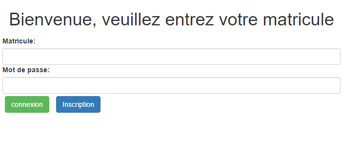
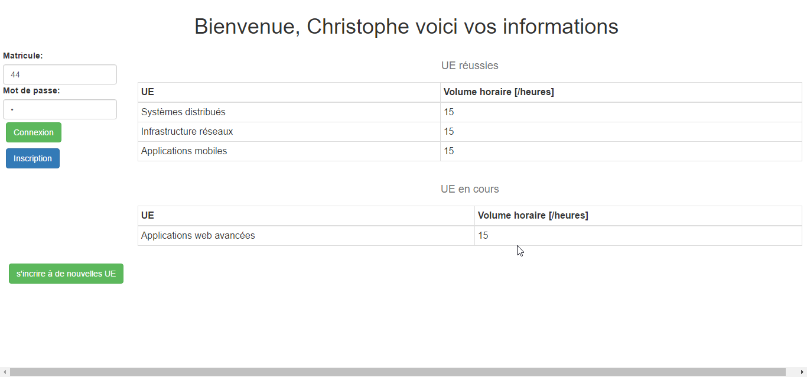
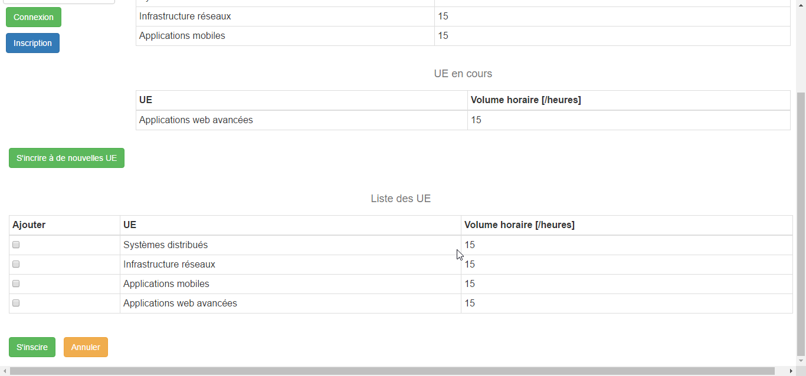

Interface utilisateur
===========

L'interface utilisateur de ce projet est une interface codée en HTML et e JQuery. Elle premet de créer des nouveaux étudiants (students). Elle permet également aux étudiants de se connecter pour avoir accès au détails de leurs UEs en cours, UE validées. Et pour finir, elle leurs permet de s'inscrire à de nouvelles UEs.

# Fonctionement de l'interface
## La page principale

Sur cette page, l'utilisateur à deux options qui s'offre à lui. La première est de se connecter à l'aide de son matricule et de son mot de passe (qui n'est pas gérer pour l'instant) en cliqant sur le bouton `Connexion`.

La deuxième option, est de s'inscrire en cliquant sur le bouton `Inscription`. En cliquant sur ce bouton, l'interface fait alors apparaitre des champ supplémentaire que l'utilisateur doit remplir pour s'inscrire.
Si les informations fournie par l'utilisateur sont incorrecte, l'interface affichera un popup indiquant que ces informations ne sont pas correctes.

## Étudiant connecté

Quand un étudiant ce connecte, l'interface ce déploie, et lui affiche deux tableaux contenant la liste des UE en cours et la liste des UE réussies.
Il y a également un bouton `S'inscrire à de nouvelles UEs` qui lui permet d'accéder à la dernière partie de l'interface.

## S'inscrire à de nouvelles UEs

Cette dernière partie de l'interface permet à l'étiudiant de s'inscrire à de nouvelles UEs en les sélectionnant par les `checkbox`.
Après avoir sélectionné ces UEs, il peut cliquer sur le bouton `S'inscrire` pour les ajouter à sa liste des UE en cours.
Ou il peut cliquer sur le bouton `Annuler` pour revenir à l'interface précédente.

# Amélioration et défaillance

Pour l'instant l'interface est semi fonctionnel à cause d'un problème de cross platform. C'est à dire que quand elle envoit une requête vers l'API qui gère les UEs, si cette API tourne sur un serveur local. la requête va échoué. Pour remédié à ce problème, il faudrait que chaque API fournisse un header acceptant le cross platform comme le fait la nôtre.
Pour ne pas rester bloqué, nous avons travaillé avecc une variable locale qui simulait la réponse de l'API.

Voici quelques piste d'améliorations: 
* gérer les mots de passe, il faut modifier l'API student pour qu'elle associe un mot de pass à un student.
* Pour l'instant, nous n'avons pas réussis à découper l'interface en plusieurs fichier html différent qui était intégré dans le fichier principal. En effet, après l'importation, JQuery n'arrivait pas à exploiter les éléments qui étaient importés.

Donc les grandes difficultée sont surtout de rendre toutes les API accessible pour les interfaces.

