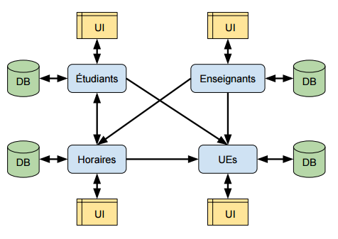

# Service Étudiants du système distribué pour le laboratoire SD5L
## Auteurs
* Christophe DE WOLF (14340)
* Guillaume VERFAILLE (11210)

<!-- START doctoc generated TOC please keep comment here to allow auto update -->
<!-- DON'T EDIT THIS SECTION, INSTEAD RE-RUN doctoc TO UPDATE -->
## Table des matières
- [Introduction](#introduction)
- [API REST](#api-rest)
- [Interface graphique](#interface-graphique)
- [Organisation du travail](#organisation-du-travail)
- [Conclusion](#conclusion)

<!-- END doctoc generated TOC please keep comment here to allow auto update -->

## Introduction
Durant ce laboratoire, nous avons été amenés à implémenter le service "Étudiants" d'un système distribué permettant de gérer le programme des étudiants de l'ECAM d'après les réformes du ministre Marcourt.

Le service étudiants de ce système est en charge des données personnelles des étudiants (matricule, nom et prénom) ainsi que de leur cursus (UE suivies et UE validées). Pour créer ce service, nous avons donc créé deux composants :

* Une API REST permettant à toutes les applications du système de consulter ou modifier les données dans notre base de données
* Une interface graphique dédiée à l'inscription des étudiants et le choix de leurs UEs.

## API REST
L'API REST est une application node.js construite avec une base de données orientée document MongoDB. Cette API a été construite pour être utilisée à la fois par l'interface graphique dédiée à la gestion des étudiants et de leur cursus, mais également par les autres composants du système distribué par exemple pour construire des horaires.

L'API REST est présentée plus en détails dans le fichier [API-server/README.md](API-server/README.md)

## Interface graphique
L'interface graphique dédiée au service étudiants permet d'inscrire et modifier des étudiants dans la base de données exposée par l'API REST. Elle permet également aux étudiants de s'inscrire à des UE. C'est une single-page application qui fonctionne dans un navigateur web, codé avec jQuery.

L'interface graphique est présentée plus en détails dans le fichier [GUI/README.md](GUI/README.md)

## Organisation du travail
Comme déjà expliqué, notre service se sépare en deux grands composants et le travail a donc été réparti selon ces deux grands axes. Bien entendu cela ne nous a pas empêchés de travailler ensemble quand nous étions bloqués ou demande de l'aide à l'autre membre du binôme.

Un autre axe important de l'organisation du travail fut d'intégrer notre service dans le système distribué plus large. Pour cela nous avons jugé important de définir l'API avant même de l'implémenter, pour que tout le monde puisse commencer à travailler. Dès le deuxième jour du laboratoire l'API était fixée et sa structure était indiquée sur le tableau blanc de la salle de laboratoire. Une fois implémentée, l'API a été décrite plus précisément dans la documentation sur GitHub, ce qui a permis aux autres groupes de la consulter aisément.

Cependant notre service n'avait besoin de communiquer qu'avec un autre (celui des UE puisque nous ne stockions que leur ID et non pas leur nom complet). Nous avons rencontré des problèmes pour cela, en particulier à cause des sécurités de cross-domain des navigateurs modernes. Heureusement nous avons pu faire tourner le service UE en local sur notre ordinateur ou simuler ses réponses pour continuer à avancer. Pour que d'autres groupes n'aient pas les mêmes problèmes, nous avons exposé notre API au web et mis les headers nécessaires;

## Conclusion
Durant ce laboratoire, nous avons réussi à implémenter un des services d'un système distribué qui permettra peut-être à l'ECAM de mieux gérer les parcours des étudiants. Nous disons peut-être car cette implémentation est plus une preuve de concept qu'un produit fini, mais les grands éléments technologiques sont là.

En fournissant une API REST exposée à tous les services et les UE, nous rendons possible une communication efficace entre différents composants de ce système. Comme ces autres composants ont été développé en parallèle, cela a demandé une certaine communication entre les équipes, que nous pensons avoir été efficace grâce à l'écriture de la documentation de l'API avant son implémentation et l'utilisation des moyens à notre disposition (tableau blanc et documents partagés par GitHub).

Nous avons également pu apprendre à faire une single page application "from scratch", càd. en partant d'un fichier HTML vide et en utilisant simplement la librairie jQuery pour créer toutes les interactions avec l'utilisateur.

Bien sûr ce laboratoire était surtout un exercice de style puisque ce système distribué est une application assez simple qui n'avait pas réellement d'intérêt à être distribué. Mais cela nous a permis d'approcher le déroulement d'une implémentation plus large, où chaque petit système est indépendant et même codé dans des langages différents, du moment que les développeurs de ces modules savent comment communiquer entre eux.